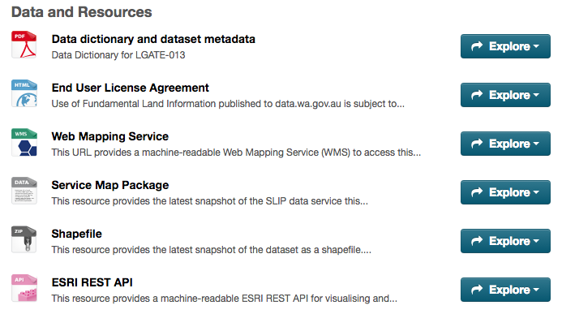

GovHack
============

Hi GovHacker,

Herein you shall find a collection of resources, tips, and examples to help you to get started using data from [data.wa.gov.au](http://data.wa.gov.au/).

# WA Government Open Data

## What data is available?

Over 700 datasets from more than 40 WA government agencies are available at [data.wa.gov.au](http://catalogue.beta.data.wa.gov.au/dataset) for use at GovHack, including:

* Property boundaries and sales records
* A high resolution aerial photo mosaic of Western Australia
* A collection of historical aerial photos dating back to 1948, and historic maps back to 1838
* Administrative boundaries
* Locations of schools, universities, hospitals, and emergency services
* Transport infrastructure
* Mining tenements and minerals deposits
* A cut of information from the 2011 Census
* Information on the sewer system, water pipes, and water meters.
* Environmental datasets and boundaries
* Mining and resources data
* Native Title determinations and Indigenous Land Use Agreements
* Aboriginal communities and heritage places
* Geological and teophysical data
* Power and water utilities data

## Help and mentors
Confused? Can't find data? Contact [our friendly team of mentors](http://portal.govhack.org/regions/western_australia.html#mentors) from across WA government who'll be available on-site in Perth, and around the country on Slack.

### I can't find the dataset I want
If you're having trouble finding a dataset don't sweat it! Data.wa.gov.au is still in its infancy and doesn't yet list every dataset in Western Australia. Talk to our team of mentors and they may be able to help you find it - they've years of experience in dealing with and tracking down datasets across all levels of government.

## Jargon busting
Throughout data.wa.gov.au and this document you'll find reference to various technical and acronyms, so we've put together a quick jaron busting guide:

*[Web Mapping Service (WMS)](https://en.wikipedia.org/wiki/Web_Map_Service):* A service for generating sets of image tiles used in web mapping. It converts raw spatial datasets into georeferenced images and is a widely used international open standard; as well it supports querying the data ("Tell me about the features at a point"). WMS services available via data.wa.gov.au are served through SLIP.

*[Web Feature Service (WFS)](https://en.wikipedia.org/wiki/Web_Feature_Service):* A service for retrieving raw geospatial datasets and running queries against a dataset (e.g. "Tell me all of the points in this area where the `type` is 'red'."). Unlike a WMS the output of a WFS service must first be passed to software that can visualise spatial data. WFS services available via data.wa.gov.au are served through SLIP.

*[ESRI REST API](http://resources.arcgis.com/en/help/arcgis-rest-api/#/The_ArcGIS_REST_API/02r300000054000000/):* A service similar very similar in functionality to WMS and WFS that is available from using the [ESRI](http://www.esri.com/) technology stack. This resource provides a machine-readable ESRI REST API for visualising and accessing this dataset. This API can be used in a variety of ESRI products – including ArcGIS, ArcGIS Pro, and the ArcGIS API for JavaScript. ESRI REST API services available via data.wa.gov.au are served through SLIP.

*[Shapefile](https://en.wikipedia.org/wiki/Shapefile):* An older but still very popular format for spatial datasets. Easy to read, manipulate, and convert to other data formats using spatial software packages.

*[Service Map Package](https://blogs.esri.com/esri/arcgis/2010/09/29/map-packages/):* A proprietary format created by the spatial sofware company, [ESRI](http://www.esri.com/), for storing spatial data and their associated styles. Only acessible to users with ArcGIS Desktop or ArcGIS Pro.

*Data dictionaries:* Documents prepared by data custodians with further in-depth information about their datasets, including descriptions and examples of each of the fields in the dataset.

*[SLIP](http://slip.landgate.wa.gov.au):* The Shared Location Information Platform (SLIP) is a repository of spatial, or location-based, datasets from Western Australian government agencies coordinated by Landgate on behalf of the WA Government. Many of the datasets you find on data.wa.gov.au will be hosted and served out of SLIP

## Public, Subscription, and Restricted datasets
The goal of data.wa.gov.au is to make all WA government data discoverable from one place - which means we have data listed that isn't 100% open. Broadly speaking there are three different classifications of data -

*Public:* Datasets that are 100% openly and freely available to use and download under a Creative Commons license.

*Subscription:* Datasets that are open to use, but are typically part of a chargeable service.

*Restricted:* Datasets that are restricted for use to authorised government agencies, typically due to their sensitive nature, and for reasons of security and privacy.

If you find a dataset that you'd like to use for GovHack that isn't public don't worry - in some cases we'll be able to give you access for a limited time to use the data in your GovHack project. Get in touch with our team of mentors regarding access.

# Using SLIP - A technical guide for developers and hackers

This rest of this document will serve as a brief overview and introduction of the SLIP platform for developers and hackers.

SLIP is a cloud-based platform utilising ESRI's [ArcGIS Server](http://www.esri.com/software/arcgis/arcgisserver) and [PostgreSQL](https://www.postgresql.org/) to provide a range of geospatial data APIs and [map services](http://slip.landgate.wa.gov.au/Pages/Public-Maps.aspx).

More general information about SLIP is available at [slip.landgate.wa.gov.au](http://slip.landgate.wa.gov.au/).

We love user-centred design, so we've written this guide for three different user personas.

1. *[The Strategist](#the-strategist):* I want to look at datasets on a map, to explore what's available, and think about how I can use data at a high-level.
2. *[The Analyst](#the-analyst):* I need to download whole datasets and use them in their raw form to analyse and interrogate them. I'm comfortable using analysis and visualisation software.
3. *[The Developer](#the-developer):* I need to design and create maps or geospatial applications for the web and mobile platforms. I'm a developer and I'm comfortable in the world of APIs and software developmemt. I'd prefer to use other people's data APIs to query and visualise data.

## Technical assistance with SLIP
Confused? Don't understand how to do something? Contact [our friendly team of mentors](http://portal.govhack.org/sponsors/landgate.html) who'll be available on-site in Perth, and around the country on Slack.

## An introduction to geospatial data and services
If you're new to working with spatial data or mapping we highly recommend you spend some time reading [mapschool.io: a free introduction to geo](http://mapschool.io/).

(Trust us - it'll save you much head scratching and bafflement later on.)

You may also want to check out the [Working with Geographic Data](http://govhack-toolkit.readthedocs.org/technical/geographic-data/) and [In which we play at being cartographers](http://govhack-toolkit.readthedocs.org/technical/making-maps/) sections in the GovHack Handbook for a deep dive on all of the awesome tools available for working with spatial data.

## The Strategist
If your goal is to quickly explore and see what data is available then there are a range of pre-packaged maps available that will make that task a breeze.

- A set of themed maps are available for Western Australia covering the themes of [environment, infrastructure, property and more](http://slip.landgate.wa.gov.au/Pages/Public-Maps.aspx).

- The [NationalMap](http://nationalmap.gov.au/) provided map-based access to spatial datasets across all levels of Australia Federal, state, and local governments.

## The Analyst
If your focus is actually getting at the raw data itself, running queries against it, and analysing it then you have the choice of downloading data and analysing it locally, or using our APIs to do the heavy lifting for you.

### Downloading data
Datasets are currently available to download from data.wa.gov.au in two formats - Shapefile and Map Package. These downloads are automatically snapshotted and refreshed on a nightly basis.

See our [Jaron busting guide](#jargon-busting) for a description of the formats.

> *Note:* While most of the datasets downloads are freely available, you will be prompted to sign in when you download a dataset. This helps us to better understand and engage with the end users of our datasets. Simply register an account and login you'll be able to proceed to download your datasets.

Once you've downloaded your datasets there's a wide range of different tools available to help you query, convert, and analyse the data:

* *Quick visualisation and data format conversion:*
  * [GeoJSON.io](http://geojson.io/#map=2/20.0/0.0): A simple website for that allows for uploading, converting, and visualising moderately sized spatial datasets. You can also draw and create your own spatial datasets - handy for creating dummy datasets!
  * [Ogre](https://ogre.adc4gis.com/): A handy website to convert many common spatial data formats (including shapefiles) to the modern [GeoJSON](http://geojson.org/) format.
  * [NationalMap](http://nationalmap.gov.au/): NationalMap is not only a handy catalogue of government datasets, you can also upload and visualise other datasets on it (supports common formats like GeoJSON, KML, GPX, and more).
* *Platform as a Service Maps:* 
  * [Carto](https://carto.com/) (**formerly CartoDB**): A simple, easy-to-use platform for everyone (not just geospatial nerds). Upload your data, hook into common datasets (e.g. country borders, administrative boundaries), and create beautiful web and mobile maps right from your browser.
  * [ArcGIS Online](https://www.arcgis.com/home/index.html): Make and share beautiful maps, and do everything in between. Maps, apps, analytics, administration, collaboration through an easy-to-use mapping solution.
  * [MapBox](https://www.mapbox.com/): Mapbox is a mapping platform for developers. Easily integrate location into any mobile or online application. Search, geocoding, real-time data, directions and routing, 2.5D and 3D maps.
* *Desktop software:*
  * [QGIS](http://www.qgis.org/en/site/): The open source Geographic Information System. Create, edit, visualise, analyse, and publish geospatial information on Windows, Mac, Linux, and BSD.
  * [ArcGIS Pro](http://www.esri.com/en/software/arcgis-pro): ArcGIS Pro reinvents desktop GIS. Design and edit in 2D and 3D, work with multiple displays and layouts, and publish finished web maps directly to ArcGIS Online or Portal for ArcGIS, connecting you to users throughout the world.
* *Databases:*
  * [PostGIS](http://postgis.net/): Spatial databases aren't just for storing data - they're great for conduct complex analysis tasks if you're happy writing SQL queries. For spatial databases consider nothing but the best: the PostGIS extension to [PostgreSQL](https://www.postgresql.org/). If there's a spatial query or manipulation you need to do then PostGIS has it; and hundreds of other functions besides.
* *Command-line:*
 * [GDAL](http://www.gdal.org/): Check out GDAL (Geospatial Data Abstraction Library), which has readers and writers for over 50 types of spatial data. GDAL bindings also exist in Python, .NET, et cetera.

### Using APIs
Datasets are currently available as live API or web service feeds from data.wa.gov.au in three flavours - WMS, WFS, and the ESRI REST API.

See our [Jaron busting guide](#jargon-busting) for a description of these APIs.

There's a wide range of different tools available to help you query, visualise, and use these services:

* *Quick visualisation:*
  * [NationalMap](http://nationalmap.gov.au/): NationalMap is not only a handy catalogue of government datasets, you can also link to third-party APIs (including WMS, WFS, ESRI, and more), as well as uploadng and visualise your own datasets on it (supports common formats like GeoJSON, KML, GPX, and more).
* *Web & mobile mapping libraries:*
 * [OpenLayers](http://openlayers.org/): A high-performance, feature-packed library for all your web mapping needs. OpenLayers makes it easy to put a dynamic map in any web page. It can display map tiles, vector data and markers loaded from any source. OpenLayers has been developed to further the use of geographic information of all kinds.
 * [Leaflet](http://leafletjs.com/): Leaflet is the leading open-source JavaScript library for mobile-friendly interactive maps. Leaflet is designed with simplicity, performance and usability in mind. It works efficiently across all major desktop and mobile platforms.
 * [ArcGIS for Developers](https://developers.arcgis.com/): Bring the power of location to your apps with ArcGIS – a mapping platform accessible to developers. Create and manage geospatial apps regardless of your developer experience. Build web, mobile, and desktops apps that incorporate mapping, visualization, analysis, and more. ESRI also has an [awesome GitHub portal for developers](http://esri.github.io/).
 * [CARTO.js](https://carto.com/docs/carto-engine/carto-js/) (formerly CartoDB.js): CARTO.js is a simple unified JavaScript library that interacts with the CARTO Engine service. This library enables you to connect to your stored visualizations, create new visualizations, add custom interaction, and access or query raw data from a web browser.
 * [Google Maps JavaScript API](https://developers.google.com/maps/documentation/javascript/): Start with the maps your users love, add the data developers trust. Build a custom map for your site using styled maps, 3D buildings, indoor floor plans, multi-modal directions and more.
 * [MapBox for Developers](https://www.mapbox.com/developers/): Mapbox is the mapping platform for developers. Build maps and applications on our simple and powerful APIs, and use our open source libraries for interactivity and control.
* *Platform as a Service Maps:* 
  * [Carto](https://carto.com/) (**formerly CartoDB**): A simple, easy-to-use platform for everyone (not just geospatial nerds). Upload your data, hook into common datasets (e.g. country borders, administrative boundaries), and create beautiful web and mobile maps right from your browser.
  * [ArcGIS Online](https://www.arcgis.com/home/index.html): Make and share beautiful maps, and do everything in between. Maps, apps, analytics, administration, collaboration through an easy-to-use mapping solution.
* *Desktop software:*
  * [QGIS](http://www.qgis.org/en/site/): The open source Geographic Information System. Create, edit, visualise, analyse, and publish geospatial information on Windows, Mac, Linux, and BSD.
  * [ArcGIS Pro](http://www.esri.com/en/software/arcgis-pro): ArcGIS Pro reinvents desktop GIS. Design and edit in 2D and 3D, work with multiple displays and layouts, and publish finished web maps directly to ArcGIS Online or Portal for ArcGIS, connecting you to users throughout the world.

## The Developer
If you need to design and create maps or geospatial applications for the web and mobile platforms then our suite of APIs have you covered.

### Using APIs
Datasets are currently available as live API or web service feeds from data.wa.gov.au in three flavours - WMS, WFS, and the ESRI REST API.

See our [Jaron busting guide](#jargon-busting) for a description of these APIs.

There's a wide range of different tools available to help you query, visualise, and use these services:

* *Quick visualisation:*
  * [NationalMap](http://nationalmap.gov.au/): NationalMap is not only a handy catalogue of government datasets, you can also link to third-party APIs (including WMS, WFS, ESRI, and more), as well as uploadng and visualise your own datasets on it (supports common formats like GeoJSON, KML, GPX, and more).
* *Web & mobile mapping libraries:*
 * [OpenLayers](http://openlayers.org/): A high-performance, feature-packed library for all your web mapping needs. OpenLayers makes it easy to put a dynamic map in any web page. It can display map tiles, vector data and markers loaded from any source. OpenLayers has been developed to further the use of geographic information of all kinds.
 * [Leaflet](http://leafletjs.com/): Leaflet is the leading open-source JavaScript library for mobile-friendly interactive maps. Leaflet is designed with simplicity, performance and usability in mind. It works efficiently across all major desktop and mobile platforms.
 * [ArcGIS for Developers](https://developers.arcgis.com/): Bring the power of location to your apps with ArcGIS – a mapping platform accessible to developers. Create and manage geospatial apps regardless of your developer experience. Build web, mobile, and desktops apps that incorporate mapping, visualization, analysis, and more. ESRI also has an [awesome GitHub portal for developers](http://esri.github.io/).
 * [CARTO.js](https://carto.com/docs/carto-engine/carto-js/) (formerly CartoDB.js): CARTO.js is a simple unified JavaScript library that interacts with the CARTO Engine service. This library enables you to connect to your stored visualizations, create new visualizations, add custom interaction, and access or query raw data from a web browser.
 * [Google Maps JavaScript API](https://developers.google.com/maps/documentation/javascript/): Start with the maps your users love, add the data developers trust. Build a custom map for your site using styled maps, 3D buildings, indoor floor plans, multi-modal directions and more.
 * [MapBox for Developers](https://www.mapbox.com/developers/): Mapbox is the mapping platform for developers. Build maps and applications on our simple and powerful APIs, and use our open source libraries for interactivity and control.
* *Platform as a Service Maps:* 
  * [Carto](https://carto.com/) (**formerly CartoDB**): A simple, easy-to-use platform for everyone (not just geospatial nerds). Upload your data, hook into common datasets (e.g. country borders, administrative boundaries), and create beautiful web and mobile maps right from your browser.
  * [ArcGIS Online](https://www.arcgis.com/home/index.html): Make and share beautiful maps, and do everything in between. Maps, apps, analytics, administration, collaboration through an easy-to-use mapping solution.
* *Desktop software:*
  * [QGIS](http://www.qgis.org/en/site/): The open source Geographic Information System. Create, edit, visualise, analyse, and publish geospatial information on Windows, Mac, Linux, and BSD.
  * [ArcGIS Pro](http://www.esri.com/en/software/arcgis-pro): ArcGIS Pro reinvents desktop GIS. Design and edit in 2D and 3D, work with multiple displays and layouts, and publish finished web maps directly to ArcGIS Online or Portal for ArcGIS, connecting you to users throughout the world.

## Even more tools for working with spatial data
We've referred to a wide range of tools here, but for a much more comprehensive list check out the [Working with Geographic Data](http://govhack-toolkit.readthedocs.org/technical/geographic-data/) and [Making maps](http://govhack-toolkit.readthedocs.org/technical/making-maps/) sections in the GovHack Handbook.
